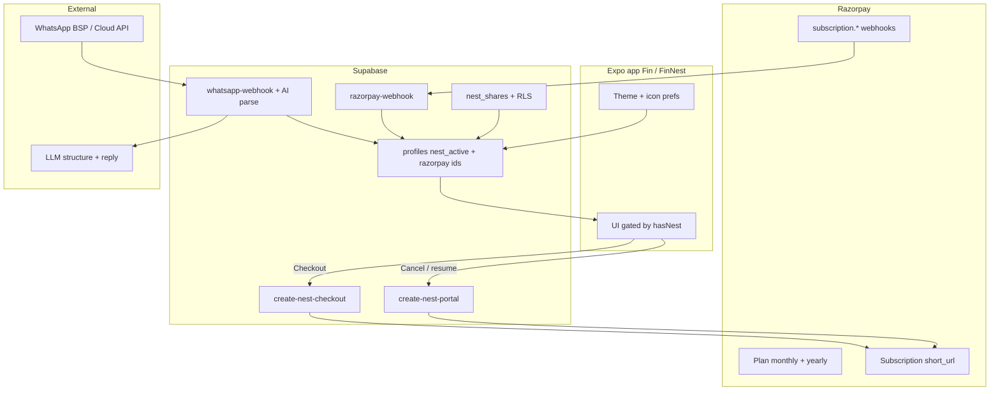

# FinNest Nest (paid tier) design

**Date:** 2026-08-04  
**Status:** Approved direction — ready for phased implementation plans  
**Product names:** Free app **Fin** · Paid unlock **Nest** → branded **FinNest** + premium badge  
**Billing:** Razorpay subscriptions only (INR) · **₹99/month** and **₹999/year**  
**Backend:** Supabase + Razorpay Subscriptions + webhook → `profiles.nest_active`  

---

## 1. Goals

Ship a paid **Nest** tier that:

1. Unlocks WhatsApp chat to add transactions / subscriptions and receive stats replies (AI structures user messages).
2. Lets a Nest member invite another user with **permissioned access** to money data (accounts, transactions, subscriptions — not profile/settings):
   - **Read only** — view data only.
   - **Read + write** — can **add** accounts / expenses / incomes / transfers / subscriptions on the owner’s Nest; can **edit/delete only rows they themselves added**; UI shows **who added** each item.
3. Lets Nest members pick font, color, and style.
4. Lets Nest members change the app icon (native alternate icons).

Free users keep core tracking (accounts, transactions, subscriptions, stats, local reminders). Nest is clearly additive.

### Non-goals (v1)

- Lifetime / one-time purchase.
- Multiple currencies for Nest prices (INR only at launch).
- Family plans with more than one invitee (start with **one invite seat**).
- Full WhatsApp Business BSP procurement docs beyond architecture (implementation plan will detail vendor).
- Changing legal entity / GST invoicing copy (handle in Razorpay invoices / later ops).

---

## 2. Product decisions (locked)

| Decision | Choice |
|----------|--------|
| Tier name | **Nest** |
| Free display name | **Fin** |
| Nest display name | **FinNest** + premium badge |
| Payment type | **Subscription only** (no lifetime) |
| Prices | **₹99 / month**, **₹999 / year** (~₹83/mo) |
| Why not lifetime | WhatsApp + **AI per message** are recurring costs; lifetime risks loss on heavy users |

### Entitlement rule

A user has Nest access when there is an **active** (or `authenticated`) Razorpay subscription for either Nest plan, linked to their `profiles.id` / auth user.

On cancel: access continues until cycle end (`cancel_at_cycle_end`), then Nest features lock and branding reverts to **Fin**.

---

## 3. High-level architecture



**Source of truth for “is Nest active?”:** `profiles.nest_active` updated by `razorpay-webhook` from Razorpay `subscription.*` events — not live Razorpay API calls on every screen.

---

## 4. Billing: Razorpay + Supabase

### 4.1 Razorpay catalog

Create in Razorpay Dashboard (INR) under **Subscriptions → Plans**:

| Product | Plan | Interval | App env |
|---------|------|----------|---------|
| Nest | monthly | month ₹99 | `RAZORPAY_PLAN_NEST_MONTHLY` |
| Nest | yearly | year ₹999 | `RAZORPAY_PLAN_NEST_YEARLY` |

### 4.2 Customer linkage

- On first checkout: Edge Function creates or reuses Razorpay Customer with `notes.supabase_user_id`.
- Store `razorpay_customer_id` + `razorpay_subscription_id` on `profiles`.

### 4.3 Checkout + manage (Edge Functions)

| Function | Role |
|----------|------|
| `create-nest-checkout` | Auth JWT → Razorpay Subscription → return `short_url` for UPI/card auth |
| `create-nest-portal` | Auth JWT → cancel_at_cycle_end (or resume); no Stripe-style hosted portal |
| `razorpay-webhook` | Verify `x-razorpay-signature` → update `nest_active`, `nest_status`, `nest_renews_at` |

App never holds Razorpay secret keys. Open `short_url` via in-app browser.

### 4.4 Entitlement

**Recommended:** `profiles.nest_active` + `nest_renews_at` updated by `razorpay-webhook`. Mobile reads profile only.

### 4.5 App UX — paywall

- Settings / Profile: **Upgrade to Nest** → plan picker (₹99/mo vs ₹999/yr) → Razorpay hosted URL.
- Nest members: **Manage Nest** → cancel at cycle end; show renew date; badge on header.
- Return from browser refreshes Nest flags via AppState / success deep link.

---

## 5. Branding: Fin → FinNest

| State | App display name | Badge |
|-------|------------------|-------|
| Free / lapsed | **Fin** | none |
| Nest active | **FinNest** | premium badge (lime accent) |

Implementation notes:

- Prefer **in-app** title/header (Profile, home greeting, Settings about) driven by `hasNest` — no store listing rename required per purchase.
- Optional later: Android adaptive icon / iOS alternate display name are limited; **do not** rely on changing the Play Store title dynamically.
- Splash / about footer: “Fin” vs “FinNest”.

---

## 6. Nest features

### 6.1 WhatsApp Nest (AI chat)

**User flow**

1. Nest member opens **Connect WhatsApp** → verifies phone / links WhatsApp number to `profiles.id`.
2. User messages the FinNest WhatsApp business number in natural language.
3. Edge Function `whatsapp-webhook` receives message → auth by linked phone → calls LLM with strict JSON schema → writes transaction / transfer / subscription or returns stats text.
4. Bot replies in WhatsApp with confirmation or clarifying question.

**Supported intents (v1)**

| Intent | Result |
|--------|--------|
| Add expense / income | Insert `transactions` |
| Transfer | Insert transfer txn |
| Add / update subscription | Insert/update `subscriptions` |
| Stats question | Read aggregates → short WhatsApp reply |

**AI cost control (required given ₹99 pricing)**

| Control | v1 default |
|---------|------------|
| Soft monthly AI message cap | **100 structured turns / billing month** (configurable) |
| Over cap | WhatsApp reply: limit reached; open app or wait until renew |
| Model | Cheap structured model first; escalate only if needed |
| Logging | `nest_ai_usage(user_id, period, count)` |

**Tables (sketch)**

- `whatsapp_links(user_id, phone_e164, provider_wa_id, verified_at, created_at)`
- `whatsapp_messages` (optional audit: direction, raw text, parsed json, tokens)
- `nest_ai_usage(user_id, period_yyyy_mm, message_count)`

**Security**

- Only Nest-active users can link / have messages processed.
- Webhook signature verify (Meta / BSP).
- Never expose other users’ data in stats replies.

### 6.2 Shared Nest (invite + permissions)

**User flow**

1. Nest owner invites by email (or in-app user) → creates `nest_shares` row with an access mode.
2. Invitee accepts → joins the owner’s Nest ledger (not the invitee’s own books mixed in).
3. Owner can revoke anytime.

**v1 scope**

- **One active invite seat** per Nest owner.
- Access modes (pick one per invite):

| Mode | Can see | Can add | Can edit / delete |
|------|---------|---------|-------------------|
| **Read only** | Owner’s accounts, transactions, subscriptions, stats (as allowed) | No | No |
| **Read + write** | Same | Yes — account, expense, income, transfer, subscription | **Only rows the invitee created**; owner can edit everything |

**Attribution (required)**

- Every money row in a shared Nest stores **who created it**.
- Schema: add `created_by uuid references profiles(id)` on:
  - `transactions`
  - `accounts`
  - `subscriptions`
- On insert: `created_by = auth.uid()`; for solo Nest users, `created_by` defaults to owner (`user_id`).
- **Ledger owner** stays `user_id` (or equivalent owner key) so balances / RLS ownership stay on the Nest owner’s books.
- UI: transaction (and account/subscription) rows show creator display name, e.g. “Added by Priya” (omit or show “You” when `created_by = auth.uid()`).

**Explicitly excluded for invitees:** profile edit, settings, billing, WhatsApp link, Nest Look/icon, export, delete account, inviting others.

**Data model**

```text
nest_shares (
  id,
  owner_user_id,          -- Nest ledger owner (must have Nest active to invite)
  member_user_id,         -- invitee (nullable until accept)
  invite_email,           -- optional for pending invites
  status: pending | active | revoked,
  access: read | write,   -- read = view only; write = add + edit own
  created_at, accepted_at, revoked_at
)
```

**RLS pattern (conceptual)**

- **SELECT** money tables: `auth.uid()` is owner **OR** active share member on that owner.
- **INSERT** (write shares only): `user_id = owner_user_id` AND `created_by = auth.uid()` AND active `access = write`.
- **UPDATE / DELETE**:
  - Owner: any row on their ledger.
  - Member with write: only rows where `created_by = auth.uid()`.
- Read-only members: no insert/update/delete.

**App UX**

- Owner: Invite → choose **Read only** or **Can add & edit own**.
- Shared Nest switcher (or banner): “Viewing Priya’s Nest” vs “My Nest”.
- Lists always show **Added by {name}** when `created_by` ≠ current user (and optionally always in shared context).
- Invitee cannot open owner’s Profile / Nest billing.

**Note for P3 plan:** balance triggers today assume `transactions.user_id` owns the account; shared writes must set `user_id` to the **owner** and `created_by` to the **member** so balances stay correct.
### 6.3 Look (font, color, style)

Device or profile prefs, Nest-gated:

| Pref | Storage | Notes |
|------|---------|-------|
| Accent color | `profiles.nest_accent` or AsyncStorage | Default lime `#a3e635` |
| Font scale / family | Nest-only font pack | 2–3 bundled fonts max (license-safe) |
| Style | `default` \| `compact` \| `soft` | Spacing / radius tokens |

Free users always get current FinNest dark + lime tokens. Nest users apply theme at root via context; persist on profile so multi-device matches.

### 6.4 App icon

- Ship **alternate app icons** via Expo config plugin / native assets (requires **dev/production build**, not Expo Go).
- Nest members pick icon in Settings → Look; free users see locked row → paywall.
- On Nest lapse: revert to default icon (best-effort; some OS versions need relaunch).

---

## 7. Client gating checklist

| Surface | Free (Fin) | Nest (FinNest) |
|---------|------------|----------------|
| Core money tracking | Yes | Yes |
| Local subscription reminders | Yes | Yes |
| WhatsApp connect / chat | Locked | Yes (+ AI caps) |
| Invite / shared Nest | Locked | Yes (1 seat; read or write+own-edit) |
| Font / color / style | Default only | Yes |
| Alternate app icon | Default only | Yes |
| Header / about name | Fin | FinNest + badge |
| Billing manage | Upgrade CTA | Portal |

Use a single hook `useNest()` → `{ hasNest, renewsAt, loading, refresh }`.

---

## 8. Implementation phases

Build in this order so billing lands before expensive WhatsApp/AI.

| Phase | Deliverable |
|-------|-------------|
| **P0 — Billing + branding** | Razorpay plans; checkout + cancel Edge Functions; webhook → `nest_active`; Fin / FinNest + badge; paywall UI |
| **P1 — Look** | Accent + style + fonts gated by Nest |
| **P2 — App icon** | Alternate icons in release builds |
| **P3 — Shared Nest** | `created_by` on money tables; `nest_shares` (`read` \| `write`); invite accept/revoke; RLS; “Added by” in UI; Nest switcher |
| **P4 — WhatsApp Nest** | Phone link, webhook, AI schema parse, write txns/subs, stats replies, usage caps |

Each phase gets its own implementation plan under `docs/superpowers/plans/` when execution starts.

---

## 9. Pricing vs cost (guardrails)

At **₹99/mo**, Nest must assume light AI use:

- Cap AI turns (see §6.1).
- Prefer cheap structured extraction; cache stats templates.
- WhatsApp BSP fees monitored monthly; pause new links if unit economics break.
- Yearly **₹999** improves cashflow but still not unlimited AI — **same monthly AI cap** (or 12× rolled yearly budget — decide in P4 plan; default = **same 100/month**).

---

## 10. Privacy / trust

- Sharing is opt-in and revocable; invitee sees only permitted money data.
- WhatsApp messages may be processed by LLM provider — disclose in Privacy Policy + Nest connect screen.
- Razorpay customer + invoices handled under Razorpay + FinNest privacy update.

---

## 11. Success metrics (post-launch)

- Nest conversion rate (free → paid).
- Monthly vs yearly mix.
- WhatsApp messages / Nest user / month (vs AI cap).
- Share accept rate and revoke rate.
- Churn after WhatsApp cap hits.

---

## 12. Open items for first implementation plan (P0)

1. Create Razorpay Plans + wire plan IDs as Edge secrets.
2. Webhook URL + `RAZORPAY_WEBHOOK_SECRET` for `subscription.*` events.
3. Deploy `create-nest-checkout`, `create-nest-portal`, `razorpay-webhook`; push `razorpay_*` migration.
4. Test Mode vs Live Razorpay keys (secrets only — never in Expo client).

---

## Summary

**Nest** is a **subscription** (₹99/mo or ₹999/yr) unlocked via **Razorpay** Checkout (`short_url`), with entitlement on `profiles.nest_active` via webhooks, gated in-app as **Fin → FinNest + badge**. Features unlock in phases: billing/branding → look → icons → sharing (**read-only** or **write: add anything, edit only own, show who added**) → WhatsApp+AI, with **AI usage caps** so ₹99 remains viable.
